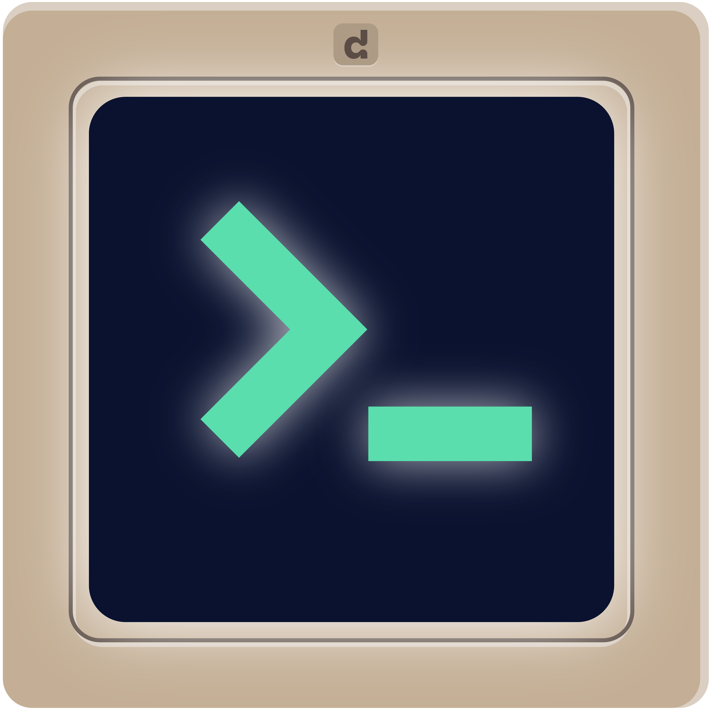

<p align="center">
  <p align="center">
    
    <h1 align="center"><b>Debricked CLI</b></h1>
    <p align="center">
    Safety through commandline.
      <br />
      <a href="https://debricked.com"><strong>debricked.com »</strong></a>
      <br />
      <br />
    </p>
  </p>
</p>

`debricked` is Debricked's command line interface. It brings open source security, compliance and health to your
project via the command prompt.
<br/>
<br/>
<a href="https://github.com/viktigpetterr/debricked-go-cli/actions/workflows/test.yml">
    
  </a>
  <a href="https://github.com/viktigpetterr/debricked-go-cli/actions/workflows/debricked.yml">
    
  </a>
    <a href="https://opensource.org/licenses/MIT">
    
  </a>
  <a href="https://github.com/debricked/cli/releases/tag/release-v2">
    
  </a>
  <a href="https://twitter.com/debrickedab">
    
  </a>
  <a href="https://www.linkedin.com/company/debricked">
    
  </a>
<p align="center">
  
  <br />
</p>

## Installation
Check out the [releases](https://github.com/debricked/cli/releases/tag/release-v2) page. Choose the asset that is applicable for your system.
Below follow some common ways to install the CLI.
### Linux
```sh
curl -LsS https://github.com/debricked/cli/releases/download/release-v2/cli_linux_x86_64.tar.gz | tar -xz debricked
```
```sh
./debricked
```
### Mac
```sh
curl -LsS https://github.com/debricked/cli/releases/download/release-v2/cli_macOS_arm64.tar.gz | tar -xz debricked
```
```sh
./debricked
```
### Windows
1. [Download zip](https://github.com/debricked/cli/releases/download/release-v2/cli_windows_x86_64.tar.gz)
2. Unpack zip
```sh
.\debricked
```
### Docker
```sh
docker pull debricked/cli:2-resolution-debian
```
## Scan
Once you've installed the CLI, you're ready to scan your project. You can scan a local project, or integrate a scanning mechanism in your CI/CD pipeline.
1. [Sign up to Debricked](https://debricked.com/app/en/register)
2. [Create an access token](https://docs.debricked.com/product/administration/generate-access-token)
3. `debricked scan -t <access-token>`

When the scan is complete, you will see the total number of vulnerabilities found and a list of automation rules that have been evaluated. Read more about automations [here](https://debricked.com/docs/automation/automation-overview.html#automation-overview).

### Docker
To make a scan directly through Docker based on your current working directory, you can use the following command:
```sh
docker run -v $(pwd):/root debricked/cli:2-resolution-debian debricked scan -t <access-token>
```

### CI/CD integration
If you would rather use `debricked` in your CI/CD pipelines, check out the [templates](examples/templates/README.md).

## Contributing
Thank you for your interest in making Debricked CLI even better! Read more about contributing to the
project [here](CONTRIBUTING.md).

## Releasing
1. Go to the [releases page](https://github.com/debricked/cli/releases), press [Draft a new release](https://github.com/debricked/cli/releases/new).

2. Create a new tag. We loosely use semantic versioning for our versions.
- Major releases should only be used for major breaking changes.
- Minor releases should be used for minor breaking changes and new major features.
- Patch releases should be used for smaller improvements, bug fixes etc. No breaking changes are allowed in these.

2a. IF you released a major version. The following needs to be done:
- For a major, a upgrade document needs to be provided like we did for the [2.0 release](https://github.com/debricked/cli/blob/main/UPGRADE-2.0.md).
- Our GitHub actions need to be updated accordingly. Like was done [in this commit](https://github.com/debricked/actions/commit/659ae7accc12313772fbfbd1b1fccec31772ce41) for the v1 -> v2 upgrade.
- Users need to be informed that a new major version is available and that they should upgrade.
- [All integration templates](https://github.com/debricked/cli/tree/main/examples/templates) needs to be updated to use the new major version.
- Our documentation needs to be updated to use the new major version.

3. After having created a new tag in the New release dialogue. Press `Generate release notes` to get some sane default notes. Adjust if necessary. It will look something like this:


4. When satisfied, press `Publish release`.


