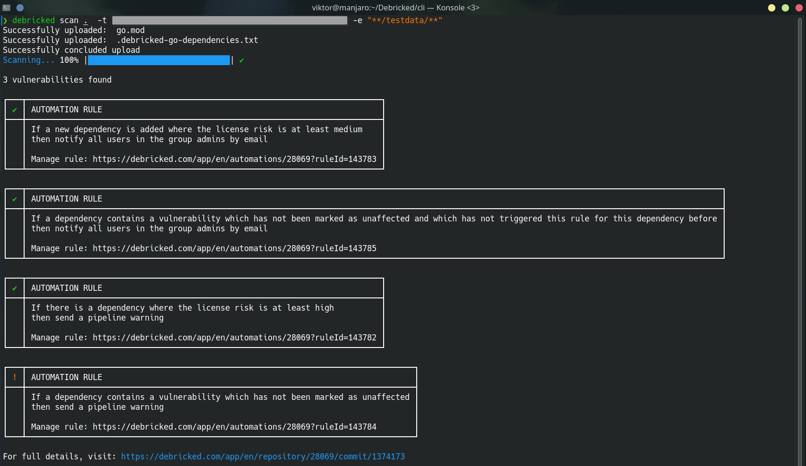

  

# Debricked CLI

`debricked` is Debricked's own command line interface. It brings open source security, compliance and health to your
project via the command prompt.  

## Beta software ⚠️

This product is only meant to be used for testing purposes.

## Installation

Check out the [releases](https://github.com/debricked/cli/releases).
