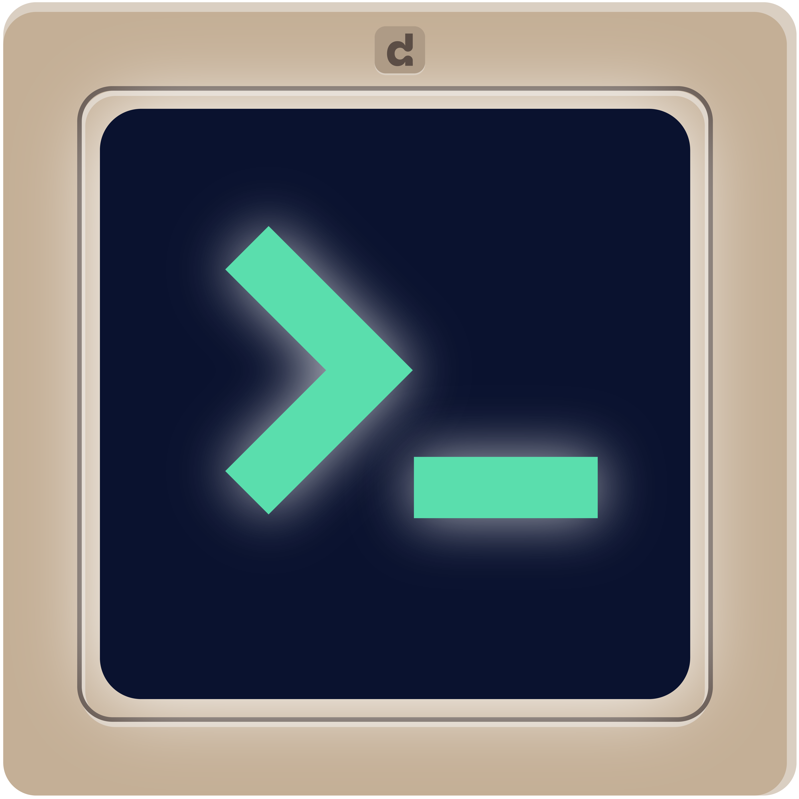

<p align="center">
  <p align="center">
    
    <h1 align="center"><b>Debricked CLI</b></h1>
    <p align="center">
    Safety through commandline.
      <br />
      <a href="https://debricked.com"><strong>debricked.com »</strong></a>
      <br />
      <br />
    </p>
  </p>
</p>

`debricked` is Debricked's command line interface. It brings open source security, compliance and health to your
project via the command prompt.
<br/>
<br/>
<a href="https://github.com/viktigpetterr/debricked-go-cli/actions/workflows/test.yml">
    
  </a>
  <a href="https://github.com/viktigpetterr/debricked-go-cli/actions/workflows/debricked.yml">
    
  </a>
    <a href="https://opensource.org/licenses/MIT">
    
  </a>
  <a href="https://github.com/debricked/cli/releases/tag/release-v2">
    
  </a>
  <a href="https://twitter.com/debrickedab">
    
  </a>
  <a href="https://www.linkedin.com/company/debricked">
    
  </a>
<p align="center">
  
  <br />
</p>

## Installation
Check out the [releases](https://github.com/debricked/cli/releases/tag/release-v2) page. Choose the asset that is applicable for your system.
Below follow some common ways to install the CLI.
### Linux
```sh
curl -LsS https://github.com/debricked/cli/releases/download/release-v2/cli_linux_x86_64.tar.gz | tar -xz debricked
```
```sh
./debricked
```
### Mac
```sh
curl -LsS https://github.com/debricked/cli/releases/download/release-v2/cli_macOS_arm64.tar.gz | tar -xz debricked
```
```sh
./debricked
```
### Windows
1. [Download zip](https://github.com/debricked/cli/releases/download/release-v2/cli_windows_x86_64.tar.gz)
2. Unpack zip
```sh
.\debricked
```
### Docker
```sh
docker pull debricked/cli:2-resolution-debian
```
## Scan
Once you've installed the CLI, you're ready to scan your project. You can scan a local project, or integrate a scanning mechanism in your CI/CD pipeline.
1. [Sign up to Debricked](https://debricked.com/app/en/register)
2. [Create an access token](https://docs.debricked.com/product/administration/generate-access-token)
3. `debricked scan -t <access-token>`

When the scan is complete, you will see the total number of vulnerabilities found and a list of automation rules that have been evaluated. Read more about automations [here](https://debricked.com/docs/automation/automation-overview.html#automation-overview).

### Exit codes
| Code | Meaning |
| ---- | ------- |
| 0    | The scan completed and no triggered automation rule failed the pipeline |
| 1    | The scan failed. This covers triggered automation rules configured to fail the pipeline, resolution failures (see below), and errors such as a bad access token or an unreachable service |
| 3    | The scan completed, but some (not all) dependency files failed to resolve. Only produced by `--resolution-strictness=3` |

Failed resolution of dependency files affects the scan and its exit code according to
`--resolution-strictness` (default `1`):

| Level | Meaning |
| ----- | ------- |
| 0     | Always continue the scan, even if any or all files failed to resolve |
| 1     | Exit with code 1 if all files failed to resolve, otherwise continue the scan |
| 2     | Exit with code 1 if any file failed to resolve, otherwise continue the scan |
| 3     | Exit with code 1 if all files failed to resolve. If some but not all files failed to resolve, complete the scan and then exit with code 3 |

A resolution failure typically means the relevant package manager is not installed or not on the
`PATH` (for example `mvn` or `composer`).

If Debricked's scan queue is long, the CLI stops polling for progress and exits with code 1, having
printed a link to the results. Pass `--pass-on-timeout` to exit 0 in that case instead.

### Docker
To make a scan directly through Docker based on your current working directory, you can use the following command:
```sh
docker run -v $(pwd):/root debricked/cli:2-resolution-debian debricked scan -t <access-token>
```

### CI/CD integration
If you would rather use `debricked` in your CI/CD pipelines, check out the [templates](examples/templates/README.md).

## MCP
`debricked mcp start` runs a [Model Context Protocol](https://modelcontextprotocol.io) server over stdio, letting
AI coding assistants (Claude, Copilot, Cursor, etc.) check whether a dependency is allowed by your Fortify SCA
policies before it's installed.

1. Authenticate once with `debricked auth login`, or have a [Debricked access token](https://docs.debricked.com/product/administration/generate-access-token) ready to pass via `--access-token`/`DEBRICKED_TOKEN`.
2. Point your MCP client at the `debricked` binary with the `mcp start` arguments. Examples below assume `debricked`
   is on your `PATH`; otherwise use the full path to the binary.

### VS Code (`.vscode/mcp.json`)
```jsonc
{
  "servers": {
    "debricked": {
      "type": "stdio",
      "command": "debricked",
      "args": ["mcp", "start"]
    }
  }
}
```

### Claude Desktop (`claude_desktop_config.json`)
```jsonc
{
  "mcpServers": {
    "debricked": {
      "type": "stdio",
      "command": "debricked",
      "args": ["mcp", "start"]
    }
  }
}
```

### Cursor (`.cursor/mcp.json`)
```jsonc
{
  "mcpServers": {
    "debricked": {
      "type": "stdio",
      "command": "debricked",
      "args": ["mcp", "start"]
    }
  }
}
```

If you haven't run `debricked auth login`, pass the token explicitly instead:
```jsonc
{
  "command": "debricked",
  "args": ["mcp", "start"],
  "env": {
    "DEBRICKED_TOKEN": "<access-token>"
  }
}
```

## Policy
Validate your `debricked_policy.json` against Debricked's policy schema before you scan, so that a
broken policy file is caught locally instead of in your pipeline.

```sh
debricked policy validate                                  # validates ./debricked_policy.json
debricked policy validate .debricked/debricked_policy.json # validates a specific file
debricked policy validate .debricked                       # validates debricked_policy.json in that directory
```

Each validation error is printed on its own line, prefixed with the property it concerns:
```
⨯ debricked_policy.json has 2 validation errors
policies[0].name: The property name is required
policies[0].rules: Array must have at least 1 item
```

Pass `--output json` (`-o json`) to emit the result as JSON for CI integrations. Validation results
are written to stdout, other failures to stderr, which keeps the JSON output parseable:
```json
{
  "file": "debricked_policy.json",
  "valid": false,
  "errors": [
    {
      "propertyPath": "policies[0].name",
      "message": "The property name is required",
      "context": {"constraint": "required"}
    }
  ]
}
```

### Exit codes
| Code | Meaning |
| ---- | ------- |
| 0    | The policy file is valid |
| 1    | The policy file contains validation errors |
| 2    | The validation could not be performed, for example due to a missing policy file, a bad access token or an unreachable service |

## Contributing
Thank you for your interest in making Debricked CLI even better! Read more about contributing to the
project [here](CONTRIBUTING.md).

## Releasing
1. Go to the [releases page](https://github.com/debricked/cli/releases), press [Draft a new release](https://github.com/debricked/cli/releases/new).

2. Create a new tag. We loosely use semantic versioning for our versions.
- Major releases should only be used for major breaking changes.
- Minor releases should be used for minor breaking changes and new major features.
- Patch releases should be used for smaller improvements, bug fixes etc. No breaking changes are allowed in these.

2a. IF you released a major version. The following needs to be done:
- For a major, a upgrade document needs to be provided like we did for the [2.0 release](https://github.com/debricked/cli/blob/main/UPGRADE-2.0.md).
- Our GitHub actions need to be updated accordingly. Like was done [in this commit](https://github.com/debricked/actions/commit/659ae7accc12313772fbfbd1b1fccec31772ce41) for the v1 -> v2 upgrade.
- Users need to be informed that a new major version is available and that they should upgrade.
- [All integration templates](https://github.com/debricked/cli/tree/main/examples/templates) needs to be updated to use the new major version.
- Our documentation needs to be updated to use the new major version.

3. After having created a new tag in the New release dialogue. Press `Generate release notes` to get some sane default notes. Adjust if necessary. It will look something like this:


4. When satisfied, press `Publish release`.

5. Artifacts should be automatically built in the [Release workflow](https://github.com/debricked/cli/actions/workflows/release.yml), please monitor it to make sure that the release are done correctly. Also make sure that the [Docker workflow](https://github.com/debricked/cli/actions/workflows/docker.yml) is triggered and successful for the given tag.


